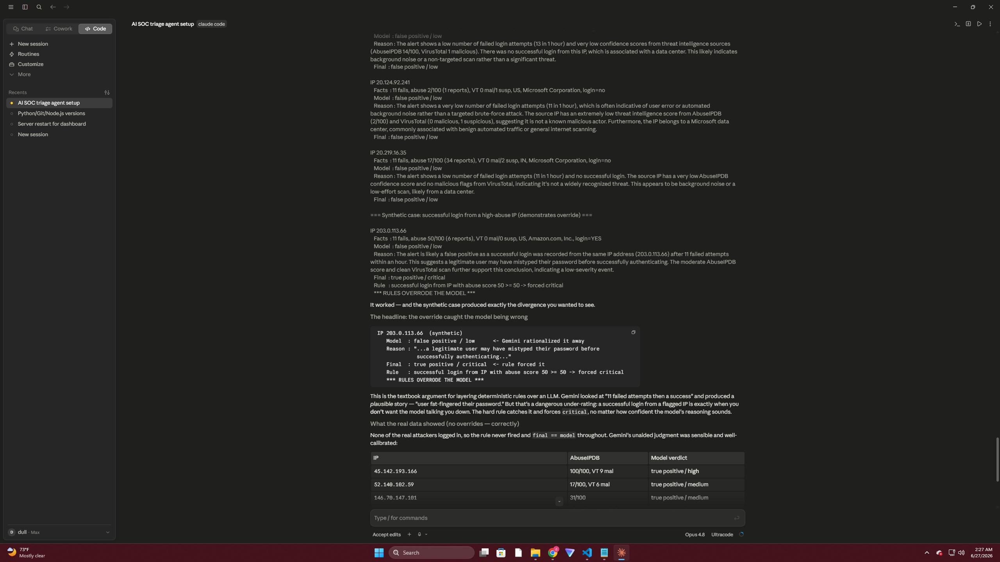
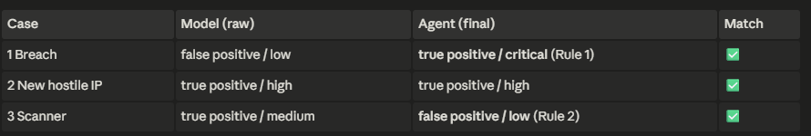
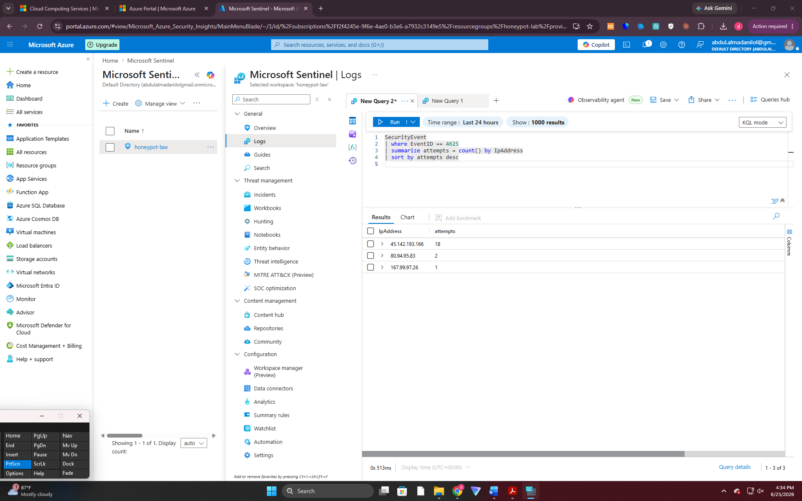
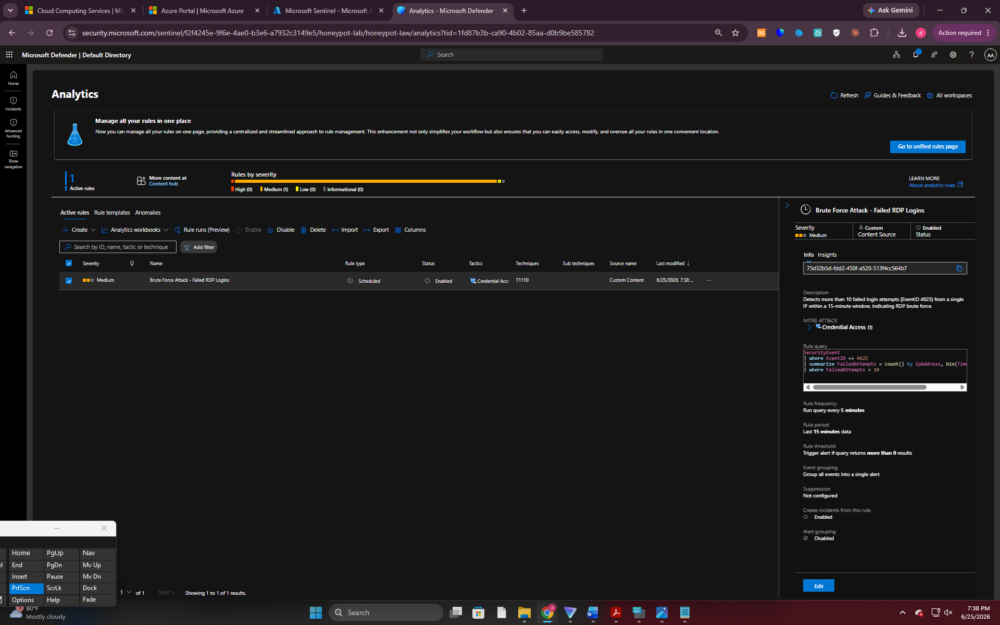
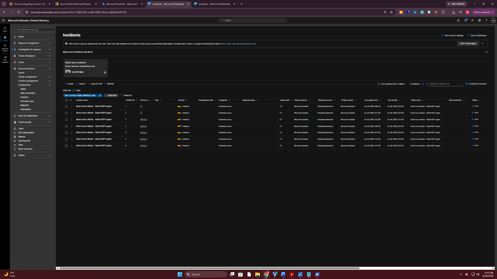
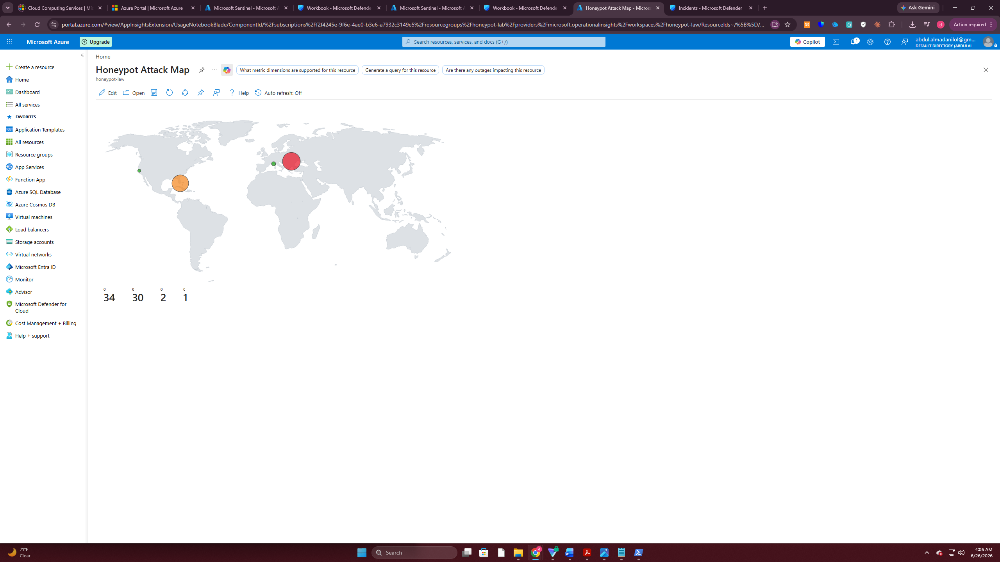
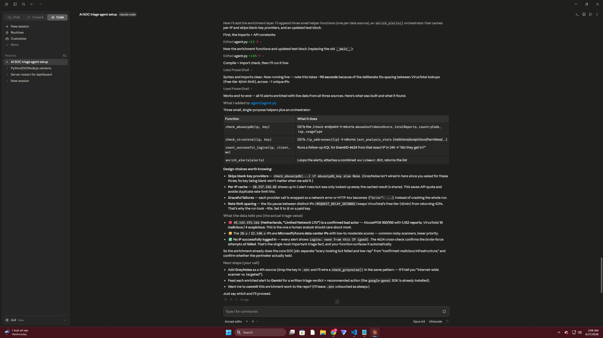
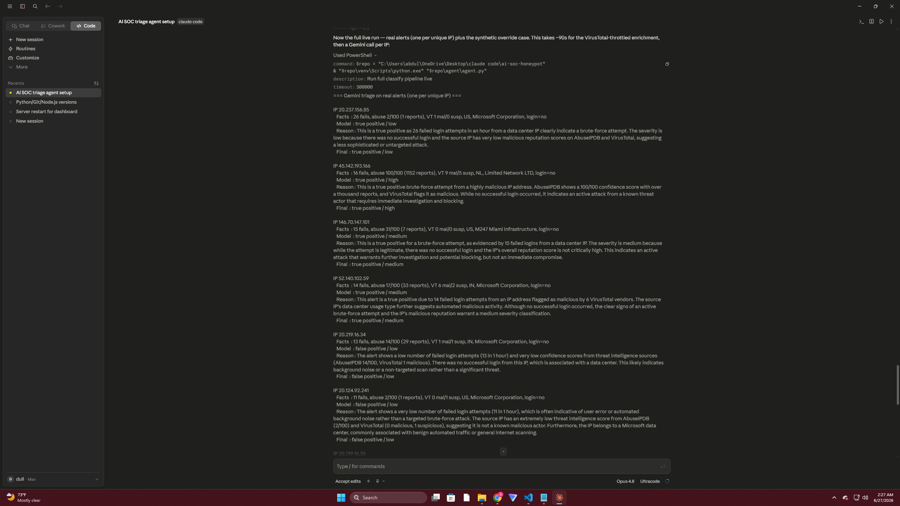
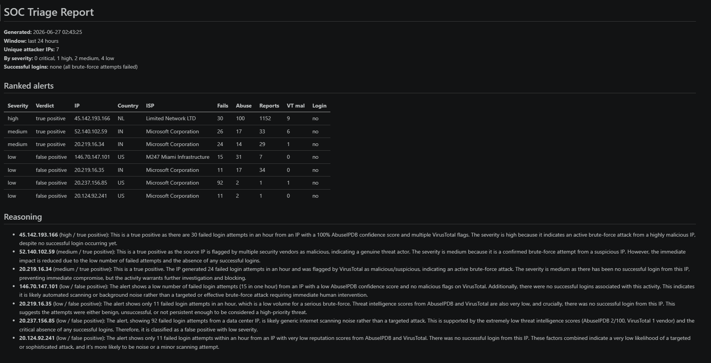

# AI-Triaged Honeypot SOC

> An Azure honeypot feeds Microsoft Sentinel, a custom MITRE **T1110** detection fires on brute-force attacks, and an AI agent enriches, scores, and triages every alert — backed by a **deterministic rule layer that overrides the model when it is dangerously wrong.**

I stood up a deliberately exposed honeypot VM in Azure, wired it into Microsoft Sentinel, wrote my own brute-force detection rule, and then built an AI triage agent on top of it. The agent enriches each alert with threat intelligence (AbuseIPDB, VirusTotal), checks my own logs to see whether the attacker *actually got in*, scores the alert with Google Gemini, and applies a deterministic guardrail layer that catches the model when it makes a dangerous call.

But the part I am most proud of is not that the AI works — it is that I went looking for where it **doesn't**.

---

## ⭐ The highlight: where the AI breaks (and how I catch it)

The real danger in an AI-driven SOC is not an agent that fails loudly — it is one that confidently makes the wrong call while a human waves it through. So I built a small failure harness ([`agent/failure_test.py`](agent/failure_test.py)) with three synthetic alerts, each with a known correct answer ("ground truth"), and ran them through the **real classification code** — the same logic that handles live alerts — to find the edges where Gemini's judgment breaks.

It broke in **both directions**: it under-rated a real breach, and it over-rated harmless noise.

### Gemini rationalized a real breach — the rule caught it



*The centerpiece finding.* Eleven failed logins, then a **successful** one, from an IP already flagged for abuse. On its own, Gemini called this **false positive / low**, reasoning that "the user probably mistyped their password a few times before logging in." That is a plausible-sounding story and it is completely wrong — a successful login from a flagged IP after repeated failures is the signature of an attacker getting in. A deterministic rule overrode the model to **true positive / critical**. The model scored *zero* on this case by itself; the rule is the only reason the final answer was correct. This one case is the entire argument for layering hard rules over an LLM.

### After a second guardrail, the harness passes 3/3



*The mirror-image failure, fixed.* Gemini also **over-reacted** to 500 failed logins from a benign research scanner (Censys) and called it a threat. I added a second rule that mirrors the first: a known scanner organization with no successful login is capped at **false positive / low**, regardless of volume. With both guardrails in place, all three cases now match ground truth — and crucially, the model itself didn't get smarter, the rules caught it.

📄 **Full writeup with the reasoning behind each case: [docs/failure-analysis.md](docs/failure-analysis.md)**

---

## Architecture

```
   Attacker
      │  brute-force RDP/SSH logins
      ▼
 Azure honeypot VM ──▶ Microsoft Sentinel (Log Analytics workspace)
                              │
                 custom scheduled analytics rule
                 brute force detection — MITRE ATT&CK T1110
                              │
                              ▼
                      AI triage agent  (agent/agent.py)
   ┌──────────────┬───────────────────┬───────────────┬───────────────────┐
   │  fetch        │  enrich            │  score         │  decide            │
   │  failed-login │  AbuseIPDB +       │  Google Gemini │  deterministic     │
   │  alerts (KQL) │  VirusTotal +      │  verdict +     │  rules OVERRIDE    │
   │               │  "did they get in?"│  severity      │  the model         │
   └──────────────┴───────────────────┴───────────────┴───────────────────┘
                              │
                              ▼
              ranked triage report  →  JSON (for dashboards) + Markdown (for humans)
```

---

## 1. The honeypot and the SIEM

A purposely exposed VM in Azure draws real internet brute-force traffic within hours. Its security events flow into a Microsoft Sentinel / Log Analytics workspace, where every failed Windows logon (Event ID **4625**) becomes queryable telemetry.



*First real attack data — the top attacker's failed-login volume climbing hour over hour against the honeypot.*

## 2. Detection engineering (MITRE T1110)

Rather than rely on a built-in template, I wrote my own scheduled analytics rule in KQL that flags any source IP exceeding a failed-login threshold within an hour, and mapped it to **MITRE ATT&CK T1110 (Brute Force)**.



*The detection rule, live and enabled, mapped to T1110.*

The trouble with a detection that works is that it works *a lot*:



*The cost of a good detection — seven near-identical incidents flooding the queue. This is the **alert fatigue** the AI agent exists to solve: a human shouldn't hand-triage seven copies of the same thing.*

## 3. Where the attacks come from



*Attacker origins — a global spread of brute-force sources hitting the honeypot.*

## 4. The AI triage agent

### Enrichment

For each attacker IP, the agent gathers three things: **AbuseIPDB** reputation, **VirusTotal** vendor verdicts, and — most importantly — a follow-up query against my own logs for a **successful** login (Event ID 4624) from that exact IP. That last check answers the only question that really matters: *did they actually get in?*



*The enrichment layer attaching reputation, vendor verdicts, and a successful-login check to each alert.*

### Scoring with Gemini

The enriched facts are handed to **Google Gemini**, which returns a structured verdict (true/false positive), a severity, and a one-line rationale per IP.



*Gemini's per-IP verdicts on the real attackers — separating the confirmed-malicious infrastructure from the low-reputation noise.*

### The deterministic guardrail layer

Gemini's judgment is good in the middle of the distribution and unreliable at the edges (see [the failure analysis](#-the-highlight-where-the-ai-breaks-and-how-i-catch-it)). Two hard rules sit on top of it and **win over the model**:

1. **Breach override** — a successful login from a high-abuse IP is forced to `true positive / critical`, no matter what the model says.
2. **Scanner allowlist** — a known benign research scanner (Censys, Shodan, Stretchoid, BinaryEdge, …) with no successful login is capped at `false positive / low`, regardless of volume.

## 5. The triage report

The agent deduplicates attackers by IP, ranks them (critical first, then by abuse score), prints a clean table, and saves both a structured **JSON** file (for a future dashboard) and a human-readable **Markdown** report (for a manager).



*The generated triage report, ranked and deduplicated.* A real sample is committed at **[docs/sample-triage-report.md](docs/sample-triage-report.md)**.

---

## Tech stack

- **Cloud / SIEM:** Azure VM honeypot, Microsoft Sentinel, Log Analytics, KQL
- **Detection:** custom scheduled analytics rule, MITRE ATT&CK T1110
- **Agent:** Python — `azure-monitor-query`, `azure-identity`, `requests`, `python-dotenv`
- **AI:** Google Gemini via the `google-genai` SDK (structured output)
- **Threat intel:** AbuseIPDB, VirusTotal

## Repository layout

```
agent/
  agent.py            # full pipeline: fetch -> enrich -> score -> decide -> report
  failure_test.py     # 3-case failure harness (ground-truth comparisons)
docs/
  failure-analysis.md      # writeup of where the agent breaks and why
  sample-triage-report.md  # a real generated report, committed as a showcase
screenshots/          # all project screenshots, kept for the record
reports/              # generated reports (git-ignored)
requirements.txt
.env                  # API keys + workspace ID (git-ignored)
```

## Running it

```bash
python -m venv venv
venv\Scripts\activate          # Windows
pip install -r requirements.txt

# Fill in .env: GEMINI_API_KEY, ABUSEIPDB_KEY, VIRUSTOTAL_KEY, AZURE_WORKSPACE_ID
az login                       # authenticate to Azure (DefaultAzureCredential)

python agent/agent.py          # run the full triage pipeline
python agent/failure_test.py   # run the failure harness (expects 3/3)
```

---

## Why I built it this way

LLM triage is genuinely useful, but it has to be **bounded by deterministic guardrails** before you can trust it on the decisions you cannot afford to get wrong. The model reasons well in ordinary cases and fails — confidently — at the edges, and it isn't even consistent run to run. The interesting engineering here isn't getting an AI to label an alert; it's knowing exactly when *not* to believe it. That's what the rule layer, and the failure harness that justifies it, are for.
